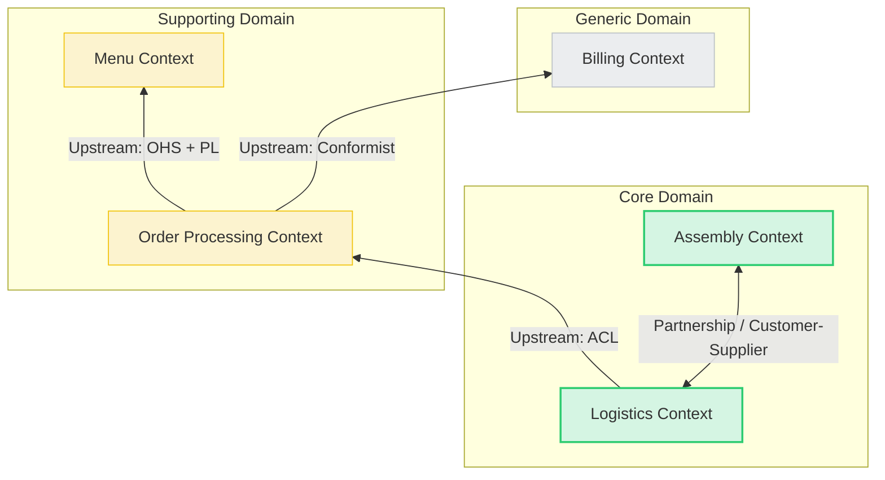

# Домашнее задание: Domain-Driven Design (Option 2)

**Домен:** Сервис экспресс-доставки продуктов (Quick Commerce).

**Проблема:** Обеспечение доставки заказа клиенту за 15-30 минут при сохранении юнит-экономики.

---

## 1. Область проблемы (Problem Space / Subdomains)

[cite_start]В рамках анализа домена были выделены следующие поддомены, классифицированные согласно их влиянию на бизнес-ценность и уникальность [cite: 226-227].

### 1.1. Courier Dispatching (Управление курьерами и маршрутизация)
* **Тип:** **Core Subdomain** (Ключевой).
* **Обоснование:** Это основной источник конкурентного преимущества. Уникальный алгоритм назначения ближайшего курьера и построения маршрута в реальном времени позволяет выполнять обещание "доставка за 15 минут". Это то, что делает бизнес уникальным и приносит ключевую ценность.

### 1.2. Darkstore Management (Управление даркстором/сборкой)
* **Тип:** **Core Subdomain** (Ключевой).
* **Обоснование:** Скорость и точность сборки заказа внутри склада критичны для модели экспресс-доставки. Оптимизация раскладки товаров и маршрута сборщика является сложной и специфичной для бизнеса задачей, требующей уникальных решений.

### 1.3. Product Catalog (Каталог товаров)
* **Тип:** **Supporting Subdomain** (Вспомогательный).
* **Обоснование:** Наличие каталога необходимо для работы сервиса, но управление карточками товаров и категориями не является уникальным конкурентным преимуществом. Это "ценное для общего домена", но реализация может быть стандартной.

### 1.4. Invoicing & Payments (Платежи и чеки)
* **Тип:** **Generic Subdomain** (Обобщенный).
* **Обоснование:** Функция приема оплаты и фискализации чеков абсолютно стандартна для любой e-commerce системы. Это не уникально для домена и лучше всего решается интеграцией готового стороннего решения.

---

## 2. Область решения (Solution Space / Bounded Contexts)

Контексты ограничены единым языком (Ubiquitous Language) и решают задачи определенных поддоменов.

| Bounded Context (Контекст) | Связанный Subdomain | Ответственность и Язык (Ubiquitous Language) |
| :--- | :--- | :--- |
| **Logistics Context** | Courier Dispatching | Понятия: `Курьер`, `Слот`, `Геозона`, `Маршрут`, `Балансировка`. Отвечает за назначение и трекинг. |
| **Assembly Context** | Darkstore Management | Понятия: `Сборщик`, `Ячейка`, `Задание на сборку`, `Пакет`. Отвечает за процесс внутри склада. |
| **Menu Context** | Product Catalog | Понятия: `SKU`, `Категория`, `Атрибуты товара`, `Изображение`. Хранит "витринные" данные. |
| **Order Processing Context** | Product Catalog (частично) + Core логика оформления | Понятия: `Корзина`, `Клиент`, `Оформленный заказ`, `Промокод`. Агрегирует данные для клиента. |
| **Billing Context** | Invoicing & Payments | Понятия: `Транзакция`, `Эквайринг`, `Возврат`. Обертка над внешним провайдером. |

---

## 3. Concept Map (Интеграция контекстов)

Ниже представлена визуализация графа контекстов и описание паттернов взаимодействия. Стрелки указывают направление зависимости (Downstream -> Upstream).

### Детальное описание интеграций

#### Интеграция 1: Menu Context -\> Order Processing Context

  * **Направление:** Menu (Upstream) -\> Order Processing (Downstream).
  * **Паттерн:** **Open-Host Service (OHS) + Published Language**.
  * **Обоснование:** Каталог товаров является источником данных для множества потребителей (сайт, мобильное приложение, аналитика, склад). Чтобы не настраивать интеграцию под каждого потребителя (Partnership), Menu Context предоставляет публичный API (OHS) и фиксированную схему данных (Published Language), которую потребляет Order Processing.

#### Интеграция 2: Order Processing Context -\> Billing Context

  * **Направление:** Billing (Upstream) -\> Order Processing (Downstream).
  * **Паттерн:** **Conformist**.
  * **Обоснование:** Billing Context часто представляет собой интеграцию с жестким API банка или внешней системы. Order Processing вынужден подстраиваться под модель данных платежного шлюза без возможности влиять на нее ("US забивает на DS, DS подстраивается").

#### Интеграция 3: Order Processing Context -\> Logistics Context

  * **Направление:** Order Processing (Upstream) -\> Logistics (Downstream).
  * **Паттерн:** **Anti-Corruption Layer (ACL)**.
  * **Обоснование:** Logistics Context — это сложный Core-домен со своей специфической моделью (`Груз`, `Вес`, `Габариты`). Ему не нужны детали из Order Processing (`Скидки`, `Название блюда`, `Маркетинговые флаги`). Чтобы защитить модель логистики от изменений в структуре заказа и перевести язык "продаж" на язык "перевозок", на стороне Logistics реализуется изолирующий слой (ACL).

#### Интеграция 4: Logistics Context \<-\> Assembly Context

  * **Направление:** Взаимозависимость (Assembly готовит заказ для Logistics, Logistics сообщает время прибытия курьера в Assembly).
  * **Паттерн:** **Customer-Supplier (Заказчик-Поставщик)**.
  * **Обоснование:** Оба контекста являются ключевыми (Core) и критически зависят друг от друга для выполнения общего SLA. Команды должны работать в тесной связке: логистика (Заказчик) формулирует требования к времени готовности, а сборка (Поставщик) обязуется их выполнять или своевременно уведомлять о задержках. Это требует кооперации при интеграции.
